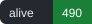
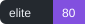
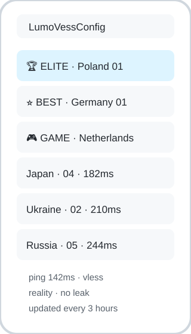
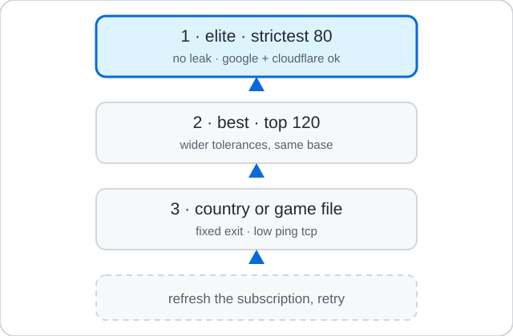
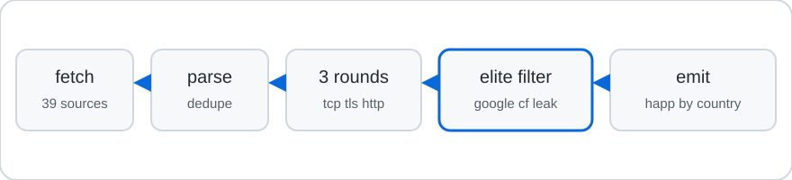

<picture>
  <source media="(prefers-color-scheme: dark)" srcset="assets/logo.svg">
  
</picture>

LumoVessConfig

Free VLESS lists that refresh every 3 hours, shaped for Happ.

I got tired of pasting dead subscriptions, so I put this together. It pulls open VLESS and proxy sources, drops duplicates, checks each node three times, and keeps the ones that actually move traffic. The files below go straight into Happ as subscriptions. Numbers above refresh with every run.

<picture>
  <source media="(prefers-color-scheme: dark)" srcset="assets/happ.svg">
  
</picture>

Add to Happ

In Happ, open subscriptions, add a new one, paste a link from below.

    https://raw.githubusercontent.com/lumskyy/LumoVessConfig/main/output/happ-elite.txt
    https://raw.githubusercontent.com/lumskyy/LumoVessConfig/main/output/happ-best.txt
    https://raw.githubusercontent.com/lumskyy/LumoVessConfig/main/output/happ-all.txt
    https://raw.githubusercontent.com/lumskyy/LumoVessConfig/main/output/happ-vless.txt
    https://raw.githubusercontent.com/lumskyy/LumoVessConfig/main/output/happ-gaming.txt

Country files use the same pattern, with the two letter code at the end:

    https://raw.githubusercontent.com/lumskyy/LumoVessConfig/main/output/countries/PL.txt
    https://raw.githubusercontent.com/lumskyy/LumoVessConfig/main/output/countries/RU.txt
    https://raw.githubusercontent.com/lumskyy/LumoVessConfig/main/output/countries/UA.txt
    https://raw.githubusercontent.com/lumskyy/LumoVessConfig/main/output/countries/JP.txt
    https://raw.githubusercontent.com/lumskyy/LumoVessConfig/main/output/countries/US.txt
    https://raw.githubusercontent.com/lumskyy/LumoVessConfig/main/output/countries/NL.txt
    https://raw.githubusercontent.com/lumskyy/LumoVessConfig/main/output/countries/DE.txt
    https://raw.githubusercontent.com/lumskyy/LumoVessConfig/main/output/countries/SG.txt

Which file to pick

Short answer: elite first, best second, a country or game file when you need something specific.

<picture>
  <source media="(prefers-color-scheme: dark)" srcset="assets/choice.svg">
  
</picture>

Elite is the strict file. It holds at most 80 nodes with a cap of 8 per country, so small countries stay visible next to the United States. Every elite node passed all three check rounds, answered both Google probes and the Cloudflare trace through itself, showed an exit IP different from the direct one, and left no checker address in the echoed headers. Its HTTP median sits under 800 ms with TCP under 500 ms, and the spread between rounds stays narrow. That last rule matters more than it looks. A node can show a fine median while freezing for seconds at a time, and those freezes wreck calls and games. The spread check keeps such nodes out of elite even when their median looks good.

Anonymity in elite means the connection layer does not expose you: no real IP in headers, exit IP belongs to the node, DNS and WebRTC have nothing of yours to show because the traffic leaves from the node address. What elite cannot promise is the server side. The machine belongs to whoever published the node, and no outside check can prove it keeps no logs. For everyday browsing, streaming and play, elite is the right default. For traffic that must stay private, run your own Reality node and keep these lists for everything else.

Best is the wider top 120 by score. Its base hygiene matches elite: no leaks, exit IP verified, at least two green rounds. Tolerances sit wider, so best includes nodes with higher ping, a single slow round, or a missing Cloudflare answer. Use it when elite feels thin on your route. In practice that happens on strict networks where few nodes answer everything.

Game files and country files solve narrower problems. The game file holds low ping TCP nodes, usually Reality or Vision, for play. A country file pins the exit to one place, which helps with regional services and with picking a nearby route. The all file goes up to 800 alive nodes and suits downloads, where a steady slower node beats a fast flaky one. The vless file is the alive set filtered to VLESS only.

When nothing connects, refresh the subscription first. Free nodes die between hours, and Happ may hold yesterday evening addresses. After refresh, step down one tier: elite to best, best to the closest country file.

What the names mean

Every line gets a name with the full country name, so the list reads well in Happ on any system. Flag emoji stay out on purpose: Windows draws them as plain letter pairs, which doubles the country code and looks broken. The first symbol tells you the tier.

    🏆 ELITE · Poland · 01 · 142ms · VLESS
    ⭐ BEST · Germany · 01 · 168ms · VLESS
    🎮 GAME · Netherlands · 01 · 188ms · VLESS
    Japan · 04 · 182ms · VLESS

After the tier comes the full country name, then the position inside that country, the measured ping and the protocol. Elite and best float to the top of an alphabetical sort.

Countries

Detection covers Poland, Russia, Ukraine and about fifty more: US, Japan, Singapore, Netherlands, Germany, Britain, France, Canada, Hong Kong, Taiwan, Korea, Australia, India, Brazil, Turkey, Finland, Sweden, Norway, Italy, Spain, Switzerland, Austria, Ireland, Romania, Kazakhstan, Emirates, Iran, Malaysia, Indonesia, Thailand, Vietnam, Philippines, Mexico and others. It reads Latin names, local names, Chinese names and flag emoji from the source tags.

A country file appears only when that country has alive nodes that hour. Free sources drift, so Poland or Ukraine can miss an hour and return the next one. UN holds nodes no tag could place.

Other clients

The same alive set ships in three more formats, refreshed together with the Happ files.

    https://raw.githubusercontent.com/lumskyy/LumoVessConfig/main/output/clash.yaml
    https://raw.githubusercontent.com/lumskyy/LumoVessConfig/main/output/singbox.json
    https://raw.githubusercontent.com/lumskyy/LumoVessConfig/main/output/v2ray.txt

Clash Verge and Clash Meta read clash.yaml, which carries Lumo-Auto and Lumo-Select groups. sing-box reads singbox.json. v2rayNG, NekoBox, Streisand and Shadowrocket read v2ray.txt, which is the base64 form of the alive list, or any happ-*.txt as plain text.

<picture>
  <source media="(prefers-color-scheme: dark)" srcset="assets/pipeline.svg">
  
</picture>

How the check works

Three rounds run with a pause between them. Round one opens TCP and records the time. Round two completes TLS where the node asks for it. Round three pushes real requests through sing-box: Google generate_204 over http and https, Cloudflare trace, an IP echo and a headers echo. A node counts as alive when TCP opens in at least two rounds and the HTTP probes answer without exposing the checker IP. Exit IP has to differ from the direct IP.

Elite adds the hard rules from the section above on top of this base. Overload cannot be read off a free node directly, so consistency across three spaced rounds stands in for it, and Happ url-test rechecks every few minutes on your side anyway. Without the sing-box binary the runner falls back to strict TCP under 350 ms with full rounds, and the site marks that run as tcp only.

Full source list and schedule

The workflow runs at minute 17 every 3 hours. It downloads 39 sources I checked by hand in September 2026, all returning live links: 0xRadikal verified and top100, Au1rxx hourly output, mehrtat xray-tested, aviamastersgh verified, hiztin GRIBI parts 1 to 3, MatinGhanbari, barry-far, Epodonios, ebrasha, Pawdroid sub, TGParse vless and mixed, SoliSpirit, V2RayRoot, Delta-Kronecker, OpenRay valid proxies, sevcator vl and ss, gfpcom vless, xrayvip free, freenode featured, wlunlocker black and white lists, igareck black VLESS and white mobile. Six AvenCores links and three small aggregators died during the check and got removed.

Parsing takes vless, vmess, trojan, ss, hysteria2 and tuic, then removes exact duplicates by id, host, port and transport. VLESS goes first because it holds up better under DPI in my tests, with Reality plus Vision ranked highest.

Site with counts

The docs folder is a small static page for GitHub Pages. It reads output/stats.json through docs/data.json and shows the update time, how many nodes came in, how many stayed alive, elite and best counts, median ping, and a table by country with copy buttons. Point the repo Pages setting at main and docs. If you attach a custom domain, the same page works there unchanged.

Limits worth knowing

Free nodes change owners, fill up, or vanish between hours. A node that passed at minute 17 can lag at minute 40. Cloudflare and game anti abuse lists flag datacenter ranges, so no free list stays green everywhere. I keep the Cloudflare and Google probe in scoring for that reason, and Happ rechecks on your side every few minutes.

Nothing here promises no logs. The server side belongs to whoever published the node. If traffic has to stay private, run your own Reality node and use these lists only for the rest.

Run it yourself

    pip install -r requirements.txt
    python -m src.run

Smaller test run:

    LUMO_ROUNDS=1 LUMO_DELAY=2 LUMO_PREFILTER=50 LUMO_MAXIN=300 python -m src.run

Files land in output and docs/data.json updates with them. Sources live in src, one job per file: fetch, parse, check, rank, emit. tools/validate.py rechecks every source URL by hand whenever you want, and tools/verify_output.py checks the generated files. Tests cover parsing, dedupe, country flags and the elite rule.

License

CC BY-SA 4.0, see LICENSE and NOTICE. The author is lumskyy, and that name stays on the project.

Anyone may use the code and the lists, but every shared copy, fork, or repost keeps lumskyy as the author with a link back here, says what changed, and stays under the same license. Stripping the nick or relicensing under looser terms ends the permission.
